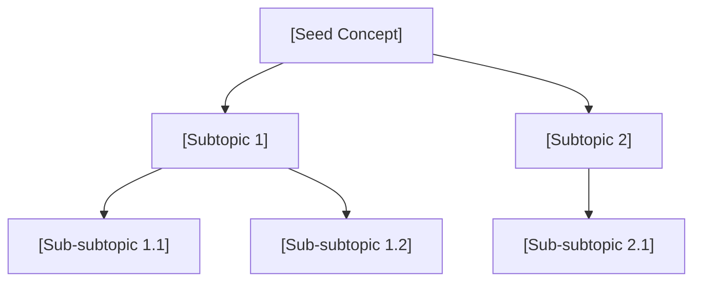

# /expand — Knowledge Landscape Expansion

> Map what you don't know yet before committing to deep research.
> The skill surfaces the *shape* of a topic, not just its content.

---

## Mental Model

```
Seed Concept
     │
     ▼
Phase 0: Orient ──── read session/knowledge-map.md
     │                    detect prior coverage; load context
     ▼
Phase 1: Decompose ── WebSearch (2–3 queries)
     │                    build subtopic tree (1 level quick / 2–3 deep)
     ▼
Stage 1: Prioritize ─ score every emerging subtopic (R + N + A + D, max 12)
     │                    8–12 → recurse immediately
     │                    5–7  → queue; continue to Phase 2
     │                    0–4  → log only; continue to Phase 2
     ▼
Phase 2: Connect ──── WebSearch (1–2 queries)
     │                    lateral links + cross-domain bridges
     ▼
Phase 3: Frontier ─── WebSearch (1–2 queries, recency-focused)
     │                    open questions / contested claims / new developments
     ▼
Phase 4: Suggest ──── generate candidate next topics
     │                    route each through Stage 1 scoring
     ▼
Stage 4: Graph ─────── write structured node entry to knowledge-map.md
     │                    YAML frontmatter for Obsidian-destined notes
     ▼
Phase 5: Persist ──── update session/knowledge-map.md
                           update session/frontier-queue.md
                           append session/exploration-log.tsv
```

**Deep dive only:** After Phase 1, spawn `knowledge-expander` subagents (one per top-level
subtopic, in parallel) to fill out each node before Phase 2. Assemble all node reports,
then proceed. Apply Stage 1 scoring to each assembled node before deciding whether to
recurse into any of them.

---

## Commands

| Invocation | Behaviour |
|---|---|
| `/expand [concept]` | Quick scan — default depth |
| `/expand [concept] --depth deep` | Full deep-dive with parallel subtopic research |
| `/expand [concept] --domain [target]` | Bias cross-domain bridges toward `[target]`; add Pathways section |
| `/expand status` | Print current knowledge map + frontier queue; no new searches |
| `/expand connect [A] [B]` | Find connection path between two explored concepts in the session map |
| `/expand frontier` | Summarise all open questions across the entire session map |
| `/expand save` | Write concept stub pages to wiki for all explored concepts not yet there |

---

## Session Files

All session state lives in `C:\Vault\.claude\skills\expand\session\`. Create on first run if absent.

| File | Purpose |
|---|---|
| `knowledge-map.md` | Cumulative graph of explored concepts + relationships |
| `frontier-queue.md` | Prioritised queue of next topics suggested across all runs |
| `exploration-log.tsv` | Timestamped record of every expansion run |

### Initialisation (first run only)

If `session/` does not exist, create the directory and seed the three files:

**knowledge-map.md:**
```markdown
# Knowledge Map
*Session started: [YYYY-MM-DD]*

## Explored Concepts
*(none yet)*

## Relationships
*(none yet)*

## Clusters
*(none yet)*
```

**frontier-queue.md:**
```markdown
# Frontier Queue

| Priority | Topic | Why Queued | From Concept | Depth Hint |
|----------|-------|-----------|-------------|------------|
```

**exploration-log.tsv:**
```
date	concept	depth	subtopics	bridges	frontiers	domain_focus	note
```

---

## Notebook ID Table

*(Populated as NLM notebooks are created for domain-specific deep dives. Initially empty.)*

| Domain / Concept Cluster | Notebook ID | Sources | Created |
|---|---|---|---|

---

## Phase 0 — Orient

1. Read `session/knowledge-map.md` — note all previously explored concepts
2. Read `session/frontier-queue.md` — note queued topics
3. Check if the seed concept (or a close synonym) is already in the map:
   - If **partially explored**: load prior facts; skip re-deriving known subtopics; note "re-expansion" in log
   - If **new**: proceed fresh
4. Parse flags from invocation:
   - `--depth quick` (default) or `--depth deep`
   - `--domain [target]` — store as `DOMAIN` variable for Phases 2 and 4
5. State the expansion plan in one sentence before proceeding (e.g. "Quick scan of [X], domain focus: Thai banking")

---

## Phase 1 — Decompose

**Goal:** Build the subtopic tree.

### Quick Scan (default)
- Run 2 WebSearch queries:
  - `"[concept]" subtopics overview introduction`
  - `"[concept]" types categories taxonomy`
- Extract 8–15 direct subtopics from results
- Organise into a 1-level nested bullet list; each node: name + 1-line description
- Flag any subtopic that already appears in `knowledge-map.md` with `[known]`

### Deep Dive (`--depth deep`)
- Run 3 WebSearch queries:
  - `"[concept]" subtopics overview introduction`
  - `"[concept]" types categories taxonomy`
  - `"[concept]" framework components structure`
- Extract 10–20 top-level subtopics
- For each top-level subtopic, spawn a `knowledge-expander` subagent (all in parallel):
  - Pass: `concept=[subtopic]`, `parent=[seed]`, `domain=[DOMAIN if set]`, `session_map_path=[path]`
- Collect all node reports; assemble into 2–3 level tree
- Build Mermaid diagram from the assembled tree (see Output Format)

**Quality gate:** Every leaf node must have a name + description. No orphan bullets.
**Branching cap:** Max 8 children per node — if wider, split into clusters with a cluster label.

---

## Stage 1 — Prioritize

**Goal:** Score every emerging topic before deciding what to do with it.

**Trigger:** Runs whenever a topic emerges — from Phase 1 subtopics, from Phase 2 bridge
destinations, from Phase 3 frontier implications, and from Phase 4 candidates. No topic
moves forward without a score.

### Scoring Rubric (0–3 per dimension, max 12)

| Dimension | 0 | 1 | 2 | 3 |
|-----------|---|---|---|---|
| **Relevance** — how directly this connects to the root domain | Tangential; unrelated field | Peripheral; indirect mechanism | Related; shares key mechanisms | Core; central mechanism of the root domain |
| **Novelty** — how absent this topic is from the session graph and existing vault | Fully explored in session | Partially explored or already in vault | In frontier queue only | Entirely absent from graph and vault |
| **Actionability** — whether this topic can produce a concrete output right now | No clear output possible | Possible but requires extensive setup | Concrete output with moderate effort | Concrete output producible immediately (note / comparison / question list) |
| **Depth Potential** — how much sub-structure this topic has for further expansion | Atomic; no sub-structure | 1–3 subtopics expected | 4–8 subtopics expected | 10+ subtopics; multiple clusters expected |

### Routing Rules

| Score | Action |
|-------|--------|
| **8–12** | **Recurse** — expand this topic immediately within the current session without waiting for user input |
| **5–7** | **Queue** — add to `frontier-queue.md`; tag status as `"deferred"` in the graph node |
| **0–4** | **Log** — record in `exploration-log.tsv`; do not expand; do not add to queue |

### When to Apply

- **After Phase 1:** score each subtopic — if any scores 8–12, recurse into it before
  proceeding to Phase 2 (deep dives only; quick scans skip immediate recursion)
- **After Phase 4:** score each next-topic candidate — routing rule determines whether to
  recurse now, defer to queue, or log only

**Quality gate:** Every scored topic must display its four sub-scores and total explicitly
before the routing decision — e.g. `R:3 N:2 A:2 D:3 = 10 → Recurse`. Never route a topic
without showing the score.

---

## Phase 2 — Connect

**Goal:** Surface lateral links and cross-domain bridges.

Run 1–2 WebSearch queries:
- `"[concept]" related "also known as" OR "similar to" OR "contrast with"`
- If `DOMAIN` set: `"[concept]" [DOMAIN] application OR "used in" OR "connects to"`

From results, identify:

**Lateral links** (same domain, not a subtopic):
- Concepts that are peers or complements to the seed — e.g., siblings in a taxonomy, or concepts that frequently co-occur in the literature

**Cross-domain bridges** (different field entirely):
- Find at least 3 domains where this concept appears under a different name or in a different context
- For each: name the shared mechanism — not just "X is used in Y" but *why* the same logic applies

If `DOMAIN` is set:
- Rank bridges by relevance to `DOMAIN` (most relevant first)
- Flag subtopics with direct `DOMAIN` application with ★ in the tree

---

## Phase 3 — Frontier

**Goal:** Identify open questions, contested areas, and recent developments.

Run 2 WebSearch queries (recency-biased):
- `"[concept]" open questions challenges limitations 2024 OR 2025 OR 2026`
- `"[concept]" debate controversy disagreement OR "still unclear" OR "remains uncertain"`

Extract and classify:
1. **Empirical gap** — a quantity or relationship not yet measured
2. **Methodological gap** — no agreed way to measure or model something
3. **Contested claim** ⚠️ — sources actively disagree; cite both sides
4. **Recent development** — something changed in the last 2 years; anchor to a date
5. **Practitioner vs. academic divide** — what practitioners do vs. what research says

**Quality gate:** At least one frontier must be contested (⚠️). At least one must be recent (cite year). Never fabricate — all frontiers must trace to an observed gap in retrieved sources.

---

## Phase 4 — Suggest

**Goal:** Produce a ranked next-topic queue.

Candidate generation:
- Take frontier questions from Phase 3 → each implies a topic worth exploring
- Take cross-domain bridges from Phase 2 → each destination domain is a candidate
- Take subtopic leaves from Phase 1 that are marked `[known]` → these may deserve re-expansion

Score each candidate through **Stage 1**. The Stage 1 score (max 12) determines both the
ranking order and the routing action. Display sub-scores inline for every candidate:
`R:N N:N A:N D:N = N → action`.

Output the top 3 (quick scan) or top 5 (deep dive), highest Stage 1 score first.
Never suggest a topic already in `knowledge-map.md` without flagging it as `[re-expansion: ...]`.
Apply the Stage 1 routing rules immediately after scoring — do not wait for user input to recurse
on any candidate that scores 8–12.

---

## Stage 4 — Feed Back to the Graph

**Goal:** Write a structured node entry for every expanded, queued, or logged topic.

**Trigger:** Runs after Phase 4 (Suggest), before Phase 5 (Persist). One node entry per
topic that emerged during the current expansion run.

### Node Entry Schema

Add each node under the `## Graph Nodes` section of `knowledge-map.md` (create the section
if absent). Use this structure:

```
- node:
    id: [slug — lowercase-kebab]
    label: [human-readable topic name]
    domain: [Thai banking | general finance | regulatory | cross-domain]
    parent: [[parent-topic-slug]]
    edge_type: [decomposition | causal | analogical | temporal | bridge]
    score: [Stage 1 total, e.g. 10]
    status: [expanded | queued | logged]
    output_type: [note | code | comparison | question_list]
```

### Edge Type Definitions

| edge_type | Meaning |
|-----------|---------|
| `decomposition` | This topic is a sub-component of the parent (e.g. Capital Adequacy is a decomposition of Financial Risk Profile) |
| `causal` | This topic is caused by or causes the parent (e.g. high deposit beta causes NIM compression) |
| `analogical` | This topic is a cross-domain analogue of the parent (e.g. Insurance IFS is analogical to Bank BCA) |
| `temporal` | This topic precedes or follows the parent in a process or timeline (e.g. TLAC reform follows post-GFC bailout era) |
| `bridge` | This topic connects two otherwise disconnected clusters (e.g. Sovereign Rating bridges BICRA to Foreign Branch methodology) |

### Obsidian YAML Frontmatter

When `output_type: note` and the note is destined for the wiki, prepend this frontmatter
block to the note body before writing:

```yaml
---
tags: [tag1, tag2]
aliases: ["alternate name 1", "alternate name 2"]
parent: "[[parent-topic-slug]]"
edge_type: decomposition | causal | analogical | temporal | bridge
score: [Stage 1 total]
status: expanded | queued | logged
---
```

### `!map` Output Format

When the user types `!map`, or at session end, render the full graph as a Markdown nested
list. Root nodes are topics with no parent in the current session. Each line shows:
**label**, (edge_type, score), [status].

```
## Session Graph

- [[seed-concept]] (score: 11) [expanded]
  - [[subtopic-a]] (decomposition, score: 9) [expanded]
    - [[sub-subtopic-a1]] (decomposition, score: 6) [queued]
  - [[subtopic-b]] (causal, score: 3) [logged]
  - [[lateral-concept]] (analogical, score: 7) [queued]
- [[second-seed]] (score: 10) [expanded]
  - ...
```

---

## Phase 5 — Persist

Update all three session files **immediately after producing output** — do not skip.

### knowledge-map.md updates:
```
## Explored Concepts
- [[seed-concept-slug]] — expanded YYYY-MM-DD; depth quick/deep; N subtopics

## Relationships
- [[seed-concept-slug]] → [[subtopic-slug]]: subtopic relationship
- [[seed-concept-slug]] ↔ [[lateral-concept-slug]]: lateral link — [mechanism]
- [[seed-concept-slug]] ⟷ [[other-domain-concept]]: cross-domain bridge — [mechanism]

## Clusters
- Cluster "[theme]": [[A]], [[B]], [[C]]  ← add when 3+ concepts share a theme
```

Only record relationships where **both** nodes have been explored. Mark speculative links with `[speculative]`.

### frontier-queue.md updates:
Prepend new rows at priority 1, shift existing rows down. Remove a topic from the queue once it has been expanded.

### exploration-log.tsv — append one row:
```
YYYY-MM-DD	[concept]	quick|deep	[subtopic count]	[bridge count]	[frontier count]	[domain or —]	[brief note]
```

---

## Output Format

### Quick Scan Output

```markdown
## 🌱 [Concept Name]
*[One-sentence definition — sourced, not circular. Cite source in parentheses.]*

---

### 🗂 Subtopics
- **[Subtopic A]** — [1-line description]
  - [Sub-subtopic A1] — [description]   ← only in deep dive
- **[Subtopic B]** — [1-line description]
- ...
*(Flag known topics with `[known]`; flag ★ if domain-relevant)*

---

### 🔗 Cross-Domain Bridges
| Domain | Connection Point | Mechanism |
|--------|-----------------|-----------|
| [field] | [shared concept name in that field] | [why the same logic applies] |
| [field] | … | … |
| [field] | … | … |

---

### 🔬 Research Frontiers
1. **[Empirical gap]** — [description]
2. **[Methodological gap]** — [description]
3. ⚠️ **[Contested claim]** — [Side A says X; Side B says Y. Sources: ...]
4. **[Recent development, YYYY]** — [description]
5. **[Practitioner vs. academic divide]** — [description]

---

### 🧭 Next Topics to Explore
1. **[Topic A]** — [one-sentence rationale; why it extends this concept]
2. **[Topic B]** — …
3. **[Topic C]** — …

---

### 📍 Session Map Update
*Added [[concept-slug]] to knowledge-map.md. [N] new relationships recorded. [M] topics added to frontier-queue.*
```

### Deep Dive Additions

After Subtopics section, add:

```markdown
### 🌲 Concept Map


### 📖 Subtopic Entries

#### [Subtopic Name]
- **Definition:** [sourced, 1 sentence]
- **Key facts:** [3–5 bullets from node-report]
- **Open questions:** [from node-report]
- **★ Domain relevance:** [only if --domain set; else omit]
```

If `--domain` flag active, add after Next Topics:

```markdown
### 🛤 Pathways into [target domain]
1. **[Entry point 1]** — [how this concept applies; which subtopic is the bridge]
2. **[Entry point 2]** — …
3. **[Entry point 3]** — …
```

---

## Special Commands

### `/expand status`
1. Read `session/knowledge-map.md` and `session/frontier-queue.md`
2. Print the full knowledge map (Explored Concepts + Relationships + Clusters)
3. Print the full frontier queue table
4. No WebSearch. No session updates.

### `/expand connect [A] [B]`
1. Read `session/knowledge-map.md`
2. Find all recorded relationships involving A and B
3. Trace shortest path: A → (intermediate nodes) → B using recorded relationships only
4. If no path exists: report "no path in current session map" — do not search for new links
5. Output: chain of [[WikiLinks]] with relationship labels

### `!map`
1. Read `session/knowledge-map.md`
2. Render the full session graph as a Markdown nested list (see Stage 4 — Feed Back to the
   Graph for the exact format): every node, its edge type to its parent, its Stage 1 score,
   and its status
3. No WebSearch. No session updates.

### `/expand frontier`
1. Read `session/knowledge-map.md` and all prior expansion outputs (grep `exploration-log.tsv` for session run dates, re-read if needed)
2. Collect all ⚠️ contested claims and frontier questions across every explored concept
3. Group by type: Empirical / Methodological / Contested / Recent / Practitioner-Academic
4. Output: grouped list with concept of origin for each item
5. No WebSearch. No session updates.

### `/expand save`
1. Read `session/knowledge-map.md` — find all explored concepts
2. For each concept not already in `C:\Vault\Wiki\concepts\`: create a stub concept page
   - Frontmatter: `title`, `type: concept`, `tags`, `created`, `updated`
   - Body: definition (from map) + "## Subtopics" section + "## Related" WikiLinks
3. Update `C:\Vault\index.md` with new stubs
4. Append to `C:\Vault\log.md`
5. Report: list of stubs created

---

## Anti-Patterns ❌

- ❌ Generating subtopics from model knowledge alone — always cross-check ≥ 2 with WebSearch
- ❌ Listing a cross-domain bridge without naming the mechanism (not "X is used in biology" — say *why*)
- ❌ Suggesting next topics already in `knowledge-map.md` without the `[re-expansion]` flag
- ❌ Skipping Phase 5 — session memory must be updated after every expansion, even if the output was short
- ❌ Fabricating research frontiers — every frontier must trace to an observed source gap
- ❌ Writing wiki pages during expansion — `/expand save` is the only command that touches wiki
- ❌ Running a deep dive without first loading `session/knowledge-map.md` (Phase 0 is mandatory)
- ❌ Recording a relationship between A and B in the map if only A has been explored
- ❌ Routing a topic without displaying its four Stage 1 sub-scores and total — `R:N N:N A:N D:N = N → action` is mandatory before any routing decision
- ❌ Assigning `edge_type: decomposition` to a lateral, analogical, or bridge relationship — choose the correct type from the five defined options
- ❌ Writing an Obsidian-destined note (output_type: note) without all six required YAML frontmatter fields (tags, aliases, parent, edge_type, score, status)
- ❌ Skipping Stage 4 — every expansion run must produce node entries; partial entries (missing any of the eight fields) are not valid

---

## Quality Standards

**Subtopic tree:**
- Every node: name + ≥ 1-line description. No unlabelled bullets.
- Subtopic must be *narrower* than its parent (no circular or lateral entries in the tree)
- Max 8 children per node; split into clusters with cluster label if wider

**Cross-domain bridges:**
- Minimum 3 bridges per expansion run
- Each must state the mechanism — how/why the same concept applies across fields
- At least 1 bridge must be non-obvious (not the top Google result)

**Research frontiers:**
- Minimum 5 per expansion run
- At least 1 contested claim (⚠️) — cite both sides
- At least 1 recent development — anchor to year; from WebSearch recency signal
- Zero fabricated questions — all from observed source gaps

**Next-topic suggestions:**
- Each includes a one-sentence rationale
- Scored and ranked (do not list alphabetically or randomly)
- None already fully explored in session without flagging

**Session memory:**
- `knowledge-map.md` updated every run without exception
- `exploration-log.tsv` row appended before the skill exits
- Relationships recorded only when both endpoints are explored concepts

**Stage 1 scoring:**
- Every routing decision shows `R:N N:N A:N D:N = N → action` inline — no silent routing
- Scores are applied consistently: the same topic scored in two separate runs should produce
  the same score (Novelty may change as the graph grows; other dimensions should be stable)
- Quick scans: Stage 1 scores are computed but immediate recursion is suppressed — routing
  is noted but only queuing/logging actions are taken (recursion requires `--depth deep`)

**Stage 4 graph feedback:**
- Every node entry includes all eight schema fields — no partial entries
- `!map` lists every node in the session graph including queued and logged nodes, not only
  expanded ones and not only root-level seeds
- YAML frontmatter is written only when the note is destined for the Obsidian wiki — do not
  wrap in-session output blocks in frontmatter
